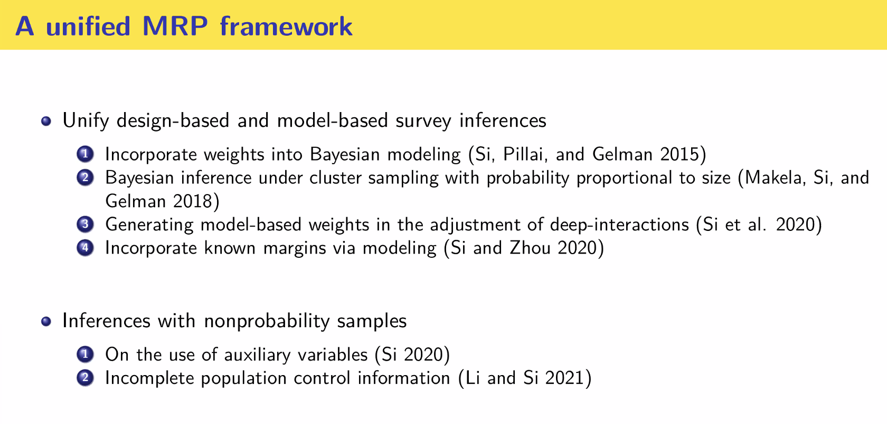

```{r, echo = FALSE, fig.cap="SSC 2021 Conference banner. Image description: Map of Canada with pink to red gradient from west to east on a black background. Test in top right says 2021 Annual Meeting - Virtual in English and French. All on black background."}

knitr::include_graphics(images/SSCDesktopBannerMap.png)
```

<i class="fa fa-user"></i> [My SSC profile](https://ssc2021.us2.pathable.com/people/XzcrQr8XdXWt4vXoK)

## Talks you should go to (very biased recommendations)

### Independent Summer Statistics Community (ISSC): Building a sustainable online undergraduate student community with Cocurricular Activities and Experiential Learning Opportunities

<i class="fa fa-calendar-plus"></i> 1:45 PM - 2:00 PM EDT on Monday, June 7

<i class="fa fa-link"></i> [Event link](https://ssc2021.us2.pathable.com/meetings/3wTmrXyDRvAisAxnT)

<i class="fa fa-user"></i> [Nathalie Moon](https://ssc2021.us2.pathable.com/people/Zbufrk98i6S8dR2mX)

#### Abstract

In response to disruptions to our students' plans due to COVID-19 and widespread feelings of isolation, we built a virtual community to help our students build portfolios, meet peers, and explore careers. In all, over 700 students in our programs signed up, and among the 164 students who responded to our end-of-summer survey, 41% were active and 48% passive participants; our data suggests that even passive participation was beneficial in making students feel more connected. As part of the ISSC, we held formal and informal data science workshops, social events, and career-building activities culminating in a DataFest COVID-19 Virtual Challenge. In all, 92 eligible teams applied to participate in DataFest, 62 were invited to compete, and 42 submitted complete submissions. In this talk, we will outline the principles guiding how the ISSC was structured including practical advice and tips for building a sustainable community, lessons learned, and plans for 2021.

#### Résumé

En réponse aux perturbations des plans des élèves en raison de la COVID-19 et au sentiment d'isolement généralisé, nous avons créé une communauté virtuelle pour aider les étudiants à monter leur portfolio, à rencontrer leurs pairs et à découvrir des carrières. En tout, plus de 700 étudiants se sont inscrits à nos programmes et, parmi les 164 étudiants qui ont répondu à notre enquête de fin d'été, 41 % étaient des participants actifs et 48 % des participants passifs. Nos données suggèrent que même la participation passive a été bénéfique en donnant aux étudiants le sentiment d'être plus connectés. Dans le cadre de la Communauté statistique indépendante d'été, nous avons organisé des ateliers formels et informels sur les sciences des données, des événements sociaux et des activités de développement de carrière, qui ont débouché au défi virtuel des données DataFest COVID-19. Au total, 92 équipes admissibles ont posé leur candidature pour participer à ce défi, 62 ont été invitées à concourir et 42 ont soumis des dossiers complets. Dans cet exposé, nous présenterons les principes qui ont guidé la structure de la Communauté statistique indépendante d'été, les conseils pratiques et les astuces qui ont contribué à créer une communauté durable, ainsi que les leçons apprises et nos plans pour 2021.

### The Development and Implementation of a Toolkit for Learning R at all Levels.

<i class="fa fa-calendar-plus"></i> 3:45 PM - 4:00 PM EDT on Wednesday, June 9

<i class="fa fa-user"></i> [Event link](https://ssc2021.us2.pathable.com/meetings/nRJ8fRhYPR6N8Qprf)

<i class="fa fa-user"></i> [Samantha-Jo Caetano](https://ssc2021.us2.pathable.com/people/wcZrSJC4wcw9TSN4i)

#### Abstract

Statistics and data science have become ubiquitous in the hard and social sciences. When working with large data or complex methodology it is crucial that the data analysts are able to program. R is a statistical programming language that is free and popular in the statistics community. R works well for data visualizations, wrangling and employing simple to complex methodology. As educators in statistics we noticed a variation of programming backgrounds in our senior students. Our team of 7 undergraduate students, 2 graduate students, and 2 assistant professors have developed a toolkit to help students improve their programming in R. The toolkit is a set of interactive modules that students complete autonomously. The modules start from the very basics of installing R to tidyverse to employing Bayesian methods. In this talk, we will outline the development and uses of this toolkit, and highlight some next steps.

#### Résumé

Les statistiques et les sciences des données sont devenues omniprésentes dans les sciences dures et humaines. En travaillant avec des données volumineuses ou des méthodologies complexes, il est primordial que les analystes de données soient capables de programmer. R est un langage de programmation gratuit et populaire au sein de la communauté statistique. Il fonctionne à merveille pour les visualisations de données, leur préparation préalable et l'adoption de méthodologies simples ou complexes. En tant qu'éducateurs en statistique, nous avons remarqué que les formations en programmation varient parmi nos étudiants de cycle supérieur. Notre équipe de sept étudiants de premier cycle, deux étudiants de cycle supérieur et deux professeurs assistants ont conçu une boîte à outils afin d'aider les étudiants à rehausser leurs aptitudes de programmation en R. La boîte à outils est composée d'un ensemble de modules interactifs que les étudiants terminent de façon autonome. Les modules commencent par la base de l'installation de R, puis progressent vers tidyverse jusqu'à l'emploi de méthodes bayésiennes. Lors de cet exposé, nous décrirons les grandes lignes du développement et de l'utilisation de cette boîte à outils, et soulignerons les étapes à venir.

## Talk notes

*Notes and reflections of varying quality from the talks I attended + resources shared.*

Note: If I've written about talk and there is anything you'd like me to correct or add, please just let me know! Twitter/email links in the navigation bar.

### Invited Presidential Address: *Probability, Statistics, and Murder*

<i class="fa fa-user"></i> Jeffrey Rosenthal, <i class="fa fa-twitter"></i> [\@ProbabilityProf](https://twitter.com/ProbabilityProf)

Jeff took us on a journey through his experiences with media and especially as an expert witness in court cases. There are a mish-mash of links below and much more on his website: <http://probability.ca>.

An example of a case that was especially interesting/surprising was when he was an expert witness in a case about a marijuana grow-op. This story was really neat because significant jail time rests on whether or not the number of plants was more or less than 500. More than 500 leads to a mandatory three-year jail term.

The level of aggressive attacks you end up facing as a expert witness sounds extremely off-putting! I'm glad Jeff's skin is think enough to go out and do this kind of work, because mine certainly is not.

Some of Jeff's final notes and advice:

-   Statisticians are nicer, especially Canadian ones.
-   Be cautious about what consulting work you agree to, especially in an adversarial context.
-   You can get paid a lot. Think about whether you want to you negotiate an hourly or fixed rate.
-   There are lots of satisfying/important aspects, but also lots of annoying/unpleasant ones, too.
-   **"If we statisticians don't do it, then who will?"**

#### Links

Here are several links that were referred to during that talk or shared in chat. (Not exhaustive.)

-   Lottery link: <http://probability.ca/lotteryscandal/>

-   Annals Quadfecta: <https://imstat.org/2021/05/14/the-annals-quadfecta-23/>

-   Jeff's Canadian Supreme Court opinion writing article: <http://probability.ca/jeff/ftpdir/SCC_UTLJ.pdf>

-   Discussion of SIDS/SUDI case history: <https://en.wikipedia.org/wiki/Sally_Clark>

    -   "The Clark case has its Aussie version that continues as Jeff speaks." - Grace Chiu <https://www.seattletimes.com/seattle-news/health/australian-mom-convicted-of-killing-4-children-seeks-pardon/>

-   www.probability.ca/justice

### Data privacy in official statistics (Panel Session)

<i class="fa fa-user"></i> [Donald Estep](http://www.sfu.ca/~destep/), Canadian Statistical Sciences Institute and Simon Fraser University, <i class="fa fa-twitter"></i> [\@donestep1](https://twitter.com/donestep1)

<i class="fa fa-user"></i> [Natalie Shlomo](https://www.research.manchester.ac.uk/portal/natalie.shlomo.html), University of Manchester

<i class="fa fa-user"></i> John Eltinge, US Census Bureau

<i class="fa fa-user"></i> Anne-Sophie Charest, Université Laval

<i class="fa fa-user"></i> Pierre Desrochers, Statistics Canada

-   People don necessarily understand what their own views on disclosure/privacy look like mathematically.
-   What is inference vs what is disclosure.
-   Uniqueness: if you publish something that is unique to one person, that is disclosure and that is fairly well agreed upon. BUT, what about as is scales up? What features makes these different, in context?
-   What 'privacy' is interpreted as is context dependent, and expressed through jurisdictional law.
-   Synthetic data generates new data by random draws from preditice models.
-   Differential privacy is a "pertubation tool", a way to add noise/misclassify probabilistically.
-   A wider ethical consider in this area is the question of which predictions are intrusions in unacceptable ways. This is more of an ethical/philosophical. When should we *not* make inferences?
-   How can we learn from others who have been doing risk communication (e.g., around health) to improve our own practices in official statistics

My background is using official statistics for social and health research in Aotearoa New Zealand, so it was excellent to dip a toe back into this world and hear about the context here.

Big thanks to CANSSI for supporting this panel. <i class="fa fa-twitter"></i> [\@CANSSIINCASS](https://twitter.com/CANSSIINCASS)

#### Links

-   Duncan, George & Keller-McNulty, Sallie & Stokes, Lynne. (2001). *Disclosure Risk vs. Data Utility: The RU Confidentiality Map*. <https://www.researchgate.net/publication/245939728_Disclosure_Risk_vs_Data_Utility_The_RU_Confidentiality_Map>
-   Kaloskampis. (2019). *Synthetic data for public good*. <https://datasciencecampus.ons.gov.uk/projects/synthetic-data-for-public-good/>
-   Near, Darais & Boeckl. (2020). *Differential Privacy for Privacy-Preserving Data Analysis: An Introduction to our Blog Series*. <https://www.nist.gov/blogs/cybersecurity-insights/differential-privacy-privacy-preserving-data-analysis-introduction-our>

### mverse: An R Library for Teaching and Conducting Multiverse Analysis

<i class="fa fa-user"></i> [Michael Moon](https://www.statistics.utoronto.ca/people/directories/graduate-students/michael-jongho-moon), University of Toronto, <i class="fa fa-twitter"></i> [\@micbonmoon](https://twitter.com/micbonmoon)

-   Motivating example, you'll get different conclusions based on the choice to keep or remove an outlier when investigating hurricane names and people's response (question: do people take hurricane's less seriously if they have a feminine name?).
-   Familiar verbs from `dplyr`, removes need to do a bunch of error prone copy and pasting (systematic).
-   Interactive modules are being developed by the team. Great demo of a Shiny app for playing with the hurricane data.
-   Submitting to CRAN sometime this summer.

Great presentation from Michael, and I'm super excited about playing with this package!

#### Links

-   Slides: <http://www.utstat.utoronto.ca/~moon/mverse-ssc21/#1>
-   Package on GitHub: <https://github.com/mverseanalysis/mverse>
-   Steegen S, Tuerlinckx F, Gelman A, Vanpaemel W. *Increasing Transparency Through a Multiverse Analysis*. Perspectives on Psychological Science. 2016;11(5):702-712. <doi:10.1177/1745691616658637> <https://journals.sagepub.com/doi/10.1177/1745691616658637>

### Independent Summer Statistics Community (ISSC): Building a sustainable online undergraduate student community with Cocurricular Activities and Experiential Learning Opportunities

<i class="fa fa-user"></i> [Nathalie Moon](https://www.statistics.utoronto.ca/people/directories/all-faculty/nathalie-moon), University of Toronto

I was part of the ISSC team, so not notes, other than I think Nathalie did a fab job explaining it.

Unofficial list of Canadian universities doing ASA DataFest: U of T, UBC, Waterloo, MacEwan/University of Alberta --- we should all be friends!

#### Links

-   [Slides](pdfs/ISSC-SSC-presentation-2021.pdf) (pdf)
-   2020 TidyTuesday activities on GitHub: <https://github.com/elb0/ISSC>

### Online Homework Impact in an Introductory Statistics Course

<i class="fa fa-user"></i> [Tharshanna Nadarajah](https://www.statistics.utoronto.ca/people/directories/all-faculty/tharshanna-nadarajah), University of Toronto

Neat intro to [MyOpenMath](https://www.myopenmath.com/) advantages and how Tharshanna has used it in teaching, student response and outcomes.

#### Links

-   MyOpenMath: <https://www.myopenmath.com>

### Tactile Response Experimental Analysis Toolkit (TREAT)

<i class="fa fa-user"></i> [Sohee Kang](https://www.utsc.utoronto.ca/cms/sohee-kang), University of Toronto

Some lovely data collection activities that students can do in class from a phone or computer. Love this from the abstract: "Students often feel disengaged with data that they do not perceive as being "real" or "authentic", and it is important that they believe that the data they are analyzing is representative of real-world problems."

#### Links

-   Movement breaks that can be used in experiments <https://ocw.utoronto.ca/movement-breaks/>

### Q&A for Statistical Education 2 session

-   Lot's of support for using Slack, though size/licensing can be challenging in large courses or with institution policy. Used for the Independent Summer Statistics Community and TA management by some courses at U of T.
-   Course emails are extremely helpful! E.g., [sta303\@utoronto.ca](mailto:sta303@utoronto.ca){.email}. Add a communication policy to your syllabus about where to go for what. We say course email is only for personal/private matters and everything else should be done via Piazza, e.g., "How many pages should this assignment be?", "What's a likelihood ratio test?" etc.

### Cautiously Constructing Charts

<i class="fa fa-user"></i> [Michael Correll](https://correll.io/), Tableau

-   "We're just making bar charts, what's ethically laden about that!" \**sarcasm intensifies*\*

-   Types of bad visualizations: deceptive, fragile, bullshit ^[In the sense of Frankfurt's _On Bullshit_ http://www2.csudh.edu/ccauthen/576f12/frankfurt__harry_-_on_bullshit.pdf], evil

-   Loved the example of the when bar charts should start at 0, but how this 'rule' is a major issue when you try to show line graphs of global temperature and demonstrate the serious increases.

    -   So, when IS it okay to truncate the y-axis? The camps Michael identifies are: the anathemists, the line chart exceptionsists, the signalers (be really explicit about truncation!). The things is, there hasn't really be testing of effectiveness in any of this.
    -   Further research suggests that rule following isn't going to cut it! The context of the charts AND the *intent* are very important.

-   There are multiple places in the pipeline where things can go wrong, but this means there are places for us to intervene!

    -   The **environment** is *curated* to **data** which is *wrangled* to **prepared data** which is *visualized* to get an **image** and that image is *read* by someone to get a **message.** (Michael has a nice image to go with this in his slides.)
    
-  Any human-computer interaction assistance project eventually just becomes Clippy.     

#### Links

-   <https://accidental-art.tumblr.com/>

-   Frankfurt. (1986). *On bullshit*. <http://www2.csudh.edu/ccauthen/576f12/frankfurt__harry_-_on_bullshit.pdf>

- McNutt, Kindlmannn & Correll. (2020). _Surfacing Visualization Mirages_ https://arxiv.org/abs/2001.02316

- Correll. (2018). _Ethical Dimensions of Visualization Research_. https://arxiv.org/pdf/1811.07271.pdf ) if that helps.

### The Case Against Explainable Artificial Intelligence and Machine Learning

<i class="fa fa-user"></i> [Boris Babic](https://borisbabic.com/), INSEAD but soon to be U of T

-  White box (like  a good ol' GLM that is easy for a human to understand) vs a black box (e.g., deep learning models), but of course there is lots of potential for grey boxes, like how many parameters is too many? What about level of understanding of the user?
-  Explainable vs interprettable 
- 'Ersatz understanding': in law/philosophy the idea of understanding is based in the 'why' between input and output.
  -  Why isn't this genuine understanding? Example given of post-hoc judge's assistant noticing a pattern and saying that is why a decision was made for denying parole, when really there could be other reasons. The assistant is the white box approximation, but the judge is the black box. 'Pseudo-understanding'. 
- We want explainable systems because this is tied to our ideas around accountability and trust.
- We also want robustness (e.g., we'd expect similar advice for similar patients in a health context). White box approximations can give us a sense of ocal faithfulness but the potential to produce super different outcomes. 
-   In summary, the main issues are pseudo/ersatz understanding—we have a false impression that we do understand what the black box is doing, the potential for non-stability when trying to use approximations, and the challenges due to existing issues with statistical literacy of data product users. Assumptions about causality, etc. 

#### Links

- Thanks to Jim Stallard for recommending _Data Visualization: Charts, Maps, and Interactive Graphics_ by Robert Grant https://www.goodreads.com/book/show/40684954-data-visualization
- Boris and collaborators have a paper coming out in this topic. Keep an eye on his website: https://borisbabic.com/research/

### Closer Than They Appear: A Bayesian Perspective On Individual-Level Heterogeneity In Risk Assessment

<i class="fa fa-user"></i> [Kristian Lum](https://ldi.upenn.edu/expert/kristian-lum-phd-msc), UPenn, <i class="fa fa-twitter"></i> [\@KLDivergence](https://twitter.com/KLdivergence)

- Kristian is so cool and I love any and every opportunity to hear her speak!
- This presentation is introducing a new project around failure-to-appear in criminal processes.
- FAT/FACT/FATE (algorithmic fairness acronyms)
- There are differences between ideas of GROUP fairness and INDIVIDUAL fairness ("people who are similar should be treated similarly"). Kristian found that this was already being discussed in the risk assessment literature but in a different way. Group probabilities and uncertainty around group-wise rates. 
- "People are certainly more than the weighted sum of their covariates"
- We tend to have to make the assumption, if we're only observing each person once, that their individual probability will be approximated by the group probability. This feels naughty. 
- What about when you DO have multiple observations per person? Well, it allows us to "take seriously" the idea that each person should only be judged on their own actions. When using group probabilities, you are being 'judged' through the actions of others. 
- In this project they are looking at using Bayesian random effects distributions and testing with a large Kentucky dataset. This tends to show us that we're in the 'large variance' situation where people are not closely grouped around their group mean. 
- Risk assessments affect the trajectory of real people's lives. 

#### Links

-   Angwin, Larson, Mattu & Lauren Kirchner. (2016). ProPublica. _Machine Bias_. 
 https://www.propublica.org/article/machine-bias-risk-assessments-in-criminal-sentencing


### On the Use of Auxiliary Variables in Multilevel Regression and Poststratification

<i class="fa fa-user"></i> [Yajuan Si](http://www-personal.umich.edu/~yajuan/), University of Michigan, <i class="fa fa-twitter"></i> [\@yajuansi](https://twitter.com/yajuansi)

-  MRP ("mister P") is multilevel regression (MR) and poststratification (P)
-  "A model-based perspective of poststratification", Gelman and motivated by Little (1993)
-  Proposed as a combo of modelling and design.
-  Rooted in survey research but also modelling and has strong assumption, reliance on auxillary variables. 
-  Fewer auxiliary, the better BUT it may violate conditional independence assumptions about cells. When constructing cells should use variables highly correlated with the outcome. 
- "Shrinking from both sides".

```{r, echo=FALSE, fig.cap="List of papers about MRP authored by Si and colleagues"}

 

```

#### Links

- Little. (1993). _Post-Stratification: A Modeler's Perspective._ https://escholarship.org/uc/item/4np24519
-  See list of papers above

### Survey Calibration via the Generalized-Method-of-Moments (GMM)

<i class="fa fa-user"></i> [Heng Chen](https://www.bankofcanada.ca/profile/heng-chen/), Bank of Canada

-  Motivation: reports that people were concerned about transmission of COVID-19 via cash.
- Consumer surveys to understand how people were using cash in response to the pandemic. April, July and November 2020. Interested in changes between first and second waves. 
-  Three main variables of interest: Cash on hand, what proportion of people are using cash, what proportion of people plan to go cashless.
-  Have repeated cross-sections and longitudinal data. 
-  For cross-sectional data, considering propensity score, selection into surveys. Then can condition on Y on selection in to the given survey. Compare $Y_1 | S_I$ with $Y_2|S_2$
-  For longitudinal, there is another 'propensity', that is to stay in both surveys, as well as the selction into the two survey waves.
-  "covariate balancing", propensity scoring has two jobs: modelling the choice and balance between weighted sample and unbiased targets. The weight (with the PS) is what helps up balance the observed value to the unbiased target.
-  Advantages of covariate balancing propensity scores: calibrated weights dual problem, "robust to (parametric) misspecification", can use GMM (stacking moments to get other parameters), flexible about the unbiased targets.
- First, choose the covariates for the PS - they will be your denominator for the moment calculation. Second, get functional forms for the propensity scores for the selection into each survey and attrition measure (for longitudinal).
- __Results for the cash research:__ Some decrease in cash on hand, but increase in having used cash and 

#### Links

-  Chen et al. (2020). _Cash and COVID-19: The impact of the pandemic on demand for and use of cash_. https://www.bankofcanada.ca/wp-content/uploads/2020/07/sdp2020-6.pdf


### An initiative for promoting an inclusive, equitable and diverse environment at SSC

Nothing specific to say other than how glad I am that SSC and NSERC and CANSSI and partner institutions are committed to improving EDI. 

<i class="fa fa-twitter"></i> Folks to follow: [\@BouchraNasri](https://twitter.com/BouchraNasri), [\@donestep1](https://twitter.com/donestep1), [\@statacake](https://twitter.com/statacake),  [\@alejandroadem](https://twitter.com/alejandroadem)

## Reading list

### Books

<i class="fa fa-book"></i> [Goodreads shelf for SSC2021](https://www.goodreads.com/review/list/44982838-liza?ref=nav_mybooks&shelf=ssc2021)

-   *Knock on Wood: Luck, Chance, and the Meaning of Everything* by Jeffrey S. Rosenthal <https://www.goodreads.com/book/show/36300756-knock-on-wood>

-  _Data Visualization: Charts, Maps, and Interactive Graphics_ by Robert Grant https://www.goodreads.com/book/show/40684954-data-visualization

### Articles

-   Jeff's Canadian Supreme Court opinion writing article: <http://probability.ca/jeff/ftpdir/SCC_UTLJ.pdf>
-   Kaloskampis. (2019). *Synthetic data for public good*. <https://datasciencecampus.ons.gov.uk/projects/synthetic-data-for-public-good/>
-   Steegen S, Tuerlinckx F, Gelman A, Vanpaemel W. *Increasing Transparency Through a Multiverse Analysis*. Perspectives on Psychological Science. 2016;11(5):702-712. <doi:10.1177/1745691616658637> <https://journals.sagepub.com/doi/10.1177/1745691616658637>
-   McNutt, Kindlmannn & Correll. (2020). _Surfacing Visualization Mirages_ https://arxiv.org/abs/2001.02316
-   Correll. (2018). _Ethical Dimensions of Visualization Research_. https://arxiv.org/pdf/1811.07271.pdf ) if that helps.

