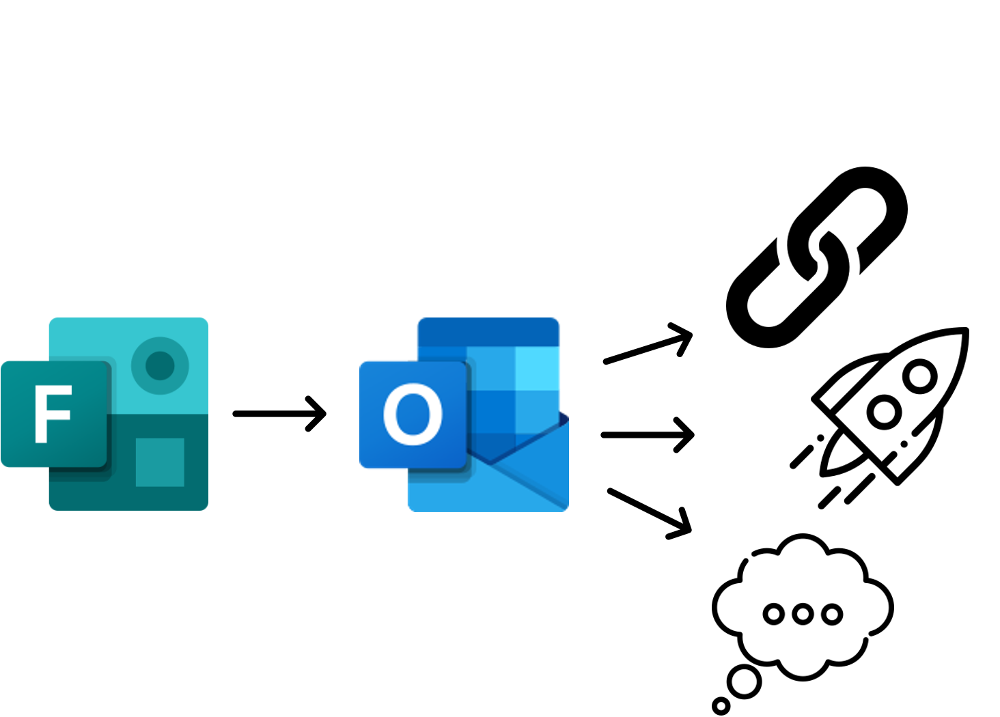
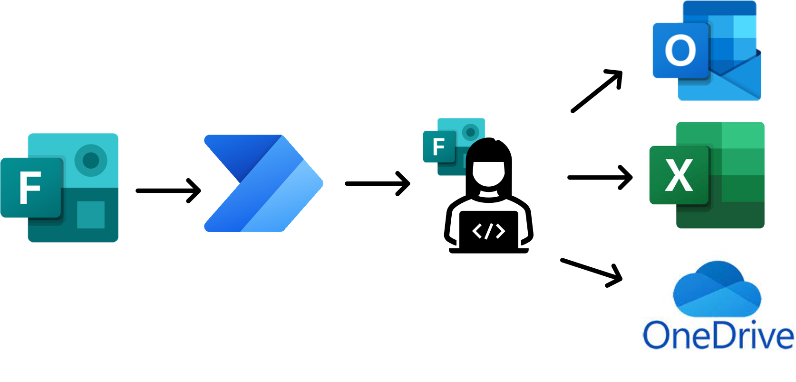
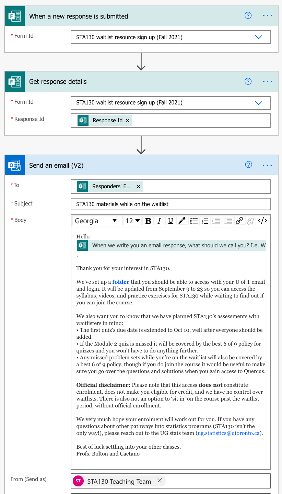

```{r setup, include=FALSE}
knitr::opts_chunk$set(echo = FALSE)
```

I want to share something that has been a bit of lifesaver for me when teaching large classes. Here at the University of Toronto we use the Microsoft Office suite of tools, and this provides access to Outlook, [Forms](https://forms.office.com/), [OneDrive](https://www.microsoft.com/en-ww/microsoft-365/onedrive/online-cloud-storage) and something called [Power Automate](https://us.flow.microsoft.com/en-us/). I use these in combination to help me with administering a range of areas in my courses.

Here is the video I threw together to demo this. I know it's not super tight in places, but I this is me practising saying to myself on being to 'extra'. Kind of. I did still make the video...

<iframe width="560" height="315" src="https://www.youtube.com/embed/cVc3u96IMcQ" title="YouTube video player" frameborder="0" allow="accelerometer; autoplay; clipboard-write; encrypted-media; gyroscope; picture-in-picture" allowfullscreen></iframe>

# The big picture experience

### Student experience

Student fills out a form, gets an email response immediately and from there can access resources/take action/get information they need.



### Teaching team experience

Create an **MS Form** and set up an associated **Power Automate** flow.

Provide a link to the From to your students, e.g., in your email autoresponder, linked in announcements, on a 'Forms' page on your course website.

Receive preformatted **emails** to respond to and/or track requests in a **spreadsheet** automatically for later checking, and/or collect **documents** in organized folders on OneDrive.



### When is this useful? 

Here are some broad categories:

-   A student has to write you a pretty formulaic email to trigger some administrative thing (regrade request, accommodation for being sick) but

    -   students frequently **forget important information** (which assessment this applies to, what their ID is, etc.), and/or

    -   students spend a lot of **time stressing about writing the email**---I'm sure I'm not the only one who has been told about explosive diarrhea in much more detail than I needed.

-   You want to **keep track of some data that students are providing,** and their provision of this data **triggers a next milestone/piece of information**. For example, students on the waitlist wanting to receive information about your course, but you want some sense of the volume of demand or just not to put it all on a public site. This could also work well for only giving access to data/instructions for a task once a team had registered their members, or perhaps for a digital scavenger hunt where one step had to be completed successfully before the next was unlocked.

-   I'm sure there are many more use cases and I'd love to hear what you come up with, if you do use this! I'm on Twitter, [\@Liza_Bolton](https://twitter.com/Liza_Bolton "My Twitter profile").

# Examples and resources

### Waitlist info sign up

Both of the large courses I teach on a regular basis usually have waitlists at the beginning of semester. The other instructors and I receive tens of emails asking about accessing resources as they wait to hopefully join the course, and of course about whether we can move students off the waitlist, which we cannot.

As we co-teach this course and have a very involved head TA, we also use a course email, instead of our personal U of T emails for all course matters. I set it up so that the email with information is sent from our course email so that student respond there if they have any further questions.

[STA130 waitlist resource sign up (Fall 2021) form template](https://forms.office.com/Pages/ShareFormPage.aspx?id=JsKqeAMvTUuQN7RtVsVSEOKHUU3SzAJJhmOKjJhDWEpUNFY2NVIwM0paVURDWktLNkVRMUxRNzVYQy4u&sharetoken=aXSGGktDs0LhqhegjfDN)



### Regrade request

[STA130 Fall 2021 template for regrade request form (the one in the video)](https://forms.office.com/Pages/ShareFormPage.aspx?id=JsKqeAMvTUuQN7RtVsVSEOKHUU3SzAJJhmOKjJhDWEpURDBaSVdNR1c1NDRWRlJXNDY3RzVXM05UQy4u&sharetoken=J2RBPqChNQ4RoWnRQGVF)

[Get the Power Automate flow (PDF) that goes with the above form](pdfs/regrade_flow.pdf)

[STA303/1002 Winter 2021 template](https://forms.office.com/Pages/ShareFormPage.aspx?id=JsKqeAMvTUuQN7RtVsVSEOKHUU3SzAJJhmOKjJhDWEpUNE02UzJaMUNQM0Q2U0RTOUlJS1JMM1dCTC4u&sharetoken=mWnEf1zTOw1V3yxjyGyx)

### Declaration of illness or emergency

[STA130 Fall 2021 template for illness/emergency declaration (the one in the video)](https://forms.office.com/Pages/ShareFormPage.aspx?id=JsKqeAMvTUuQN7RtVsVSEOKHUU3SzAJJhmOKjJhDWEpUNTBDSzdMMUxVRkMxSjhTU1NOOFJJRFdWUC4u&sharetoken=YtVOA34vsKKTt6xE2H17)

[Get the Power Automate flow (PDF) that goes with the above form](pdfs/illness_flow.pdf)

[STA303/1002 Winter 2021 template](https://forms.office.com/Pages/ShareFormPage.aspx?id=JsKqeAMvTUuQN7RtVsVSEOKHUU3SzAJJhmOKjJhDWEpUQU1aRjI2SFpSSExZUVhVWEFYVU83VVg3Qy4u&sharetoken=UYrRNpiIjnlCZoW4Ugt0)


### Recording due dates for grad school references

This one is a more complicated flow to set up, but if you write a lot of references and would like to capture the information for the students you're writing for and have the due dates automatically added to your calendar, and the student invited to the calendar event to, this is definitely possible!

Here is the [template for my old form for this](https://forms.office.com/Pages/ShareFormPage.aspx?id=JsKqeAMvTUuQN7RtVsVSEOKHUU3SzAJJhmOKjJhDWEpUNUlVTFJVNkc0Mk8wQTdXTTU4M0JWSUEwRy4u&sharetoken=eOjrzFuz021k7Via8smI)...but! One of our staff team is actually working on a more generalizable system that multiple profs could use that would also include an approval step, so students would request the reference, we'll make a judgment on whether we could write them a letter that would strengthen their application, and then if we accept, the dates get added to our calendar.

# Some other things to consider

I've also just posted [a more general blog with resources/ideas/examples of some other things I am doing for Fall semester](https://blog.lizabolton.com/posts/2021-09-07_fall-thoughts/). Is your autoresponder playing defense for you? Have you pimped your email signature lately? Did you know Canvas/Quercus supports bootstrap for layouts?


_Cover photo by <a href="https://unsplash.com/@clothandtwig?utm_source=unsplash&utm_medium=referral&utm_content=creditCopyText">Karly Santiago</a> on <a href="https://unsplash.com/s/photos/magic?utm_source=unsplash&utm_medium=referral&utm_content=creditCopyText">Unsplash</a>_
  