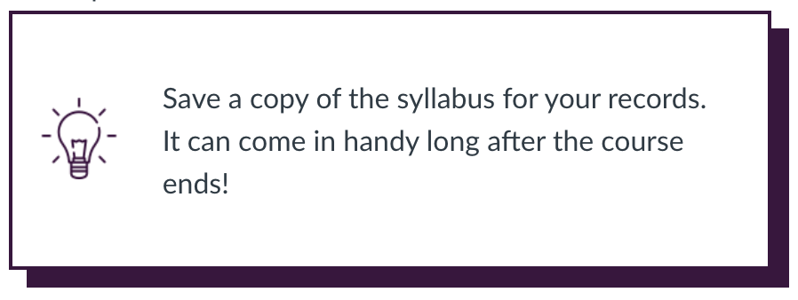

_This isn't particularly well organized but it was nice to get a few things out of my head._

### What's in your email signature? 

You can include links to mental health and other student services so that they are always at people's fingertips. I also include:

-   information about my pronouns and how to use them. But Liza, you say, everyone knows how to use "she" and "her" in a sentence, right? Well, yeah, probably. But this creates room for folks with [neopronouns](https://www.mypronouns.org/neopronouns) and still might be of use to English language learners who might not have any idea what gender my name suggests.

-   An explicit note about how and when I use emails to try to set expectations and maintain my own boundaries while also showing respect for other people's.

<div style="width: 90%; margin: 10px 5% 10px 5%; background-color: #3c133f;">

<div style="position: relative; top: -10px; left: -10px; padding: 15px; background: #ffffff; border: 2px solid #3C133F;">

***Prof. Liza Bolton*** /
*Assistant Professor, Teaching Stream*

Pronouns: [she/her/hers](https://www.mypronouns.org/she-her "https://www.mypronouns.org/she-her")

Department of Statistical Sciences, /
University of Toronto

[www.statistics.utoronto.ca](https://www.statistics.utoronto.ca/) \| [www.lizabolton.com](http://www.lizabolton.com/) \

🕘 Whatever time at which I'm sending this email works for me. I do not expect that you will read, respond to, or action this email outside of the hours that work for you. I am most likely to check emails 10--6 ET, Monday through Friday.

[***COVID-19 Student FAQs \| Faculty of Arts & Science***](https://www.artsci.utoronto.ca/covid19-artsci-student-faqs "https://www.artsci.utoronto.ca/covid19-artsci-student-faqs")

***Doing okay?*** It is always okay to reach out for support!

• [[**My Student Support Program -- My SSP**]{.ul}](https://studentlife.utoronto.ca/hwc/myssp) -- mental health support for all U of T students. Free, confidential, immediate support. Available 24/7 in multiple languages. Download the My SSP App or call 1-844-451-9700. [[uoft.me/myssp]{.ul}](http://www.uoft.me/myssp)

• Call **Good2Talk**, a free, confidential helpline for people in Ontario. Professional counselling, information and referrals for mental health, addictions and well-being, 24/7/365 [[1-866-925-5454]{.ul}](tel:1-866-925-5454)

</div>

</div>

### Is your autoresponder playing defense for you?

I keep my autoresponder on all year round. It is maybe a bit of pain for my colleagues (sorry folks!), but it saves me so much email angst that I am never going back to the old ways. If you want, you can read my lastest verion, without sending me an email [right here](https://www.lizabolton.com/autoresponder.html).

Our department meditation facilitor said she was proud of me for this, setting boundaries and all that, so if you too want to make your department's meditation facilitor^[Your department doesn't have a meditation group? That's no good. Contact Cecilia, she is awesome. Clutter Coaching is her main thing, but she's excellent as a meditation facilitator too. https://www.spaceforlife.ca/contact-1] proud, go for it!

### Automagical email and admin for large courses

See my post, [_Automagical email and admin for large courses: Getting started with Power Automate_](https://blog.lizabolton.com/posts/2021-09-07_automate/) for a run down of a workflow that helps me manage large classes and make my and my students' lives easier. 

### Making your Quercus/Canvas pretty 

This is especially great for when there is other work you should be doing, but you want to do some "productive" procrastination instead.

#### Callout boxes

Some great grab and go code here:
https://docs.google.com/document/d/1_pAW74yURHuWRD52Rp8DkAfXltJDPc1f44_YGcPW1t0/edit#

My current favourite thing is using the bootstrap responsive boxes in one of these callouts with a little picture to signal if something is note or a tip or a 'to do'.

```
<div style="width: 50%; margin: 10px 25% 10px 25%; background-color: #3c133f;">
    <div style="position: relative; top: -10px; left: -10px; padding: 15px; 
    background: #ffffff; border: 2px solid #3C133F;">
        <div class="content-box">
            <div class="grid-row">
                <div class="col col-lg-2 col-sm-12">
                    <p><span> </span></p>
                </div>
                <div class="col col-lg-10 col-sm-12">Save a copy of the 
                syllabus for your records. <br> It can come in handy long after 
                the course ends!</div>
            </div>
        </div>
    </div>
</div>
```

You'll need to change the image path for this to work for your own courses, but it will look something like this:



#### Quercus (Canvas) let's you use bootstrap to make responsive pages!

This is a slightly older version of our current STA130 home page, but it gives you a general sense of the look. The great thing about this page is that it adjust how it presents all the boxes/buttons when you are on a smaller screen. 

I have shared some example html code in a [GitHub repo](https://github.com/elb0/2021F-quercus-sta130) and there is lots of advice from more skilled folks below.

* [A useful video](https://www.youtube.com/watch?v=vtuFe4qZfck)

* [Website companion](https://www.howtocanvas.com/create-amazing-pages-in-canvas/bootstrap
<https://teams.microsoft.com/l/message/19:0d1de7e2e576453884b8355e7e8ec88a@thread.tacv2/1628176527940?tenantId=78aac226-2f03-4b4d-9037-b46d56c55210&amp;groupId=05e503fe-8a8a-4731-9a6b-32eca9b24367&amp;parentMessageId=1627504903369&amp;teamName=AS OLA CoP&amp;channelName=General&amp;createdTime=1628176527940)


You can see what Bill Ju [\@NeuroscienceUT](https://twitter.com/NeuroscienceUT) has been up to with this on his course page, too!

<blockquote class="twitter-tweet"><p lang="en" dir="ltr">So my colleagues have been sharing code and glowing up their Quercus pages - thank you for the code and inspiration and help! Acknowledging all those involved - <a href="https://twitter.com/Liza_Bolton?ref_src=twsrc%5Etfw">@Liza_Bolton</a> <a href="https://twitter.com/karenreid?ref_src=twsrc%5Etfw">@karenreid</a> <a href="https://twitter.com/JenniferAHarri2?ref_src=twsrc%5Etfw">@JenniferAHarri2</a> and Max!! <a href="https://t.co/aRWCnKT7tw">pic.twitter.com/aRWCnKT7tw</a></p>&mdash; Bill J (@NeuroscienceUT) <a href="https://twitter.com/NeuroscienceUT/status/1429979313382871042?ref_src=twsrc%5Etfw">August 24, 2021</a></blockquote> <script async src="https://platform.twitter.com/widgets.js" charset="utf-8"></script>


### JupyterHub and RStudio

This one is really just for other folks at U of T using the JupyterHub and RStudio, but that could still potentially be one of you reading this. 

<iframe src="https://rstudio-with-jupyerhub-uoft.netlify.app" width="100%" height="500" allowfullscreen="allowfullscreen" data-mce-fragment="1"></iframe>

I embed this on Quercus on a 'Course tools' page for easy students access. The embed code is:

```
<iframe src="https://rstudio-with-jupyerhub-uoft.netlify.app" width="100%"
height="500" allowfullscreen="allowfullscreen" data-mce-fragment="1"></iframe>

```

### Music and notices before class/during breaks

In both in-person and online teaching I love playing music over scrolling notice slides as I finish getting set up. You can ask the students for recommendations (I often do this in weekly check-in surveys or just ask them to email me) and/or spend way to much time finding fun songs that are somehow on theme ([Jump In the Line](https://www.youtube.com/watch?v=kMXBJW1PuU8) by Harry Belafonte for linear regression, anyone?). I sent my third-years a farewell email with our co-created playlists and the response was lovely.

If you're at U of T, [Student Life posts weekly slide decks](https://utoronto.sharepoint.com/sites/sl-sg/sl-communications/SitePages/Digital-slides.aspx?CT=1603756721400&OR=OWA-NT&CID=af798073-885d-75ca-ecf7-a315a7c99125) that I just download, remove anything irrelevant to my students and add in reminders/Department events, etc. I made this below video this time last year (sorry it is only on U of T's internal MS Stream!).

<div style='max-width: 853px'><div style='position: relative; padding-bottom: 56.25%; height: 0; overflow: hidden;'><iframe width="853" height="480" src="https://web.microsoftstream.com/embed/video/4a5b2b1a-dff5-41e8-862b-b93a87bcaf00?autoplay=false&showinfo=false" allowfullscreen style="border:none; position: absolute; top: 0; left: 0; right: 0; bottom: 0; height: 100%; max-width: 100%;"></iframe></div></div>

### Piazza thank you cards

Piazza (and probably Ed?) lets you easily access data on how many posts each student makes and how many they have read. We often send thank you cards to our top lurkers (them being across all the makes my life easier!) adn top posters. At some point I plan to do a tutorial on this, so let me know if you're interested. Great mail merge opportunity in large classes.

### Student voice

A few of us in the Department of Statistical Sciences are continueing a small pilot of a student representation initiative called the Undergraduate Consultative Committee. One of our students comms team members wrote [this article about last semester's phase 1 of the pilot](https://www.statistics.utoronto.ca/news/new-pilot-program-enhances-academic-experience-giving-students-voice).

If youre interested in creating a culture of feedback but something like that above isn't the right fit for your course or the present moment, some of my other favourite tools are clearest point/muddiest point style weekly check-ins, and/or adding a mid-semester survey with your students. These are a fabulous way to tweak and improve your course as you go, instead of having "oh, dang, I wish someone had told me that earlier" moments when you read your course evaluations. I also think it is really important to spend some of your time responding to what your hear from students, I often do this at the start of the next class. There is a nice article from our Centre for Teaching Support & Innovation (CTSI): [_The Many Benefits of Cultures of Feedback within the Classroom_](https://teaching.utoronto.ca/cultures-of-feedback/)

<br>
<br>

_Cover image from [Bo Burnham's 'White Woman's Instagram'](https://www.youtube.com/watch?v=xHotXbGZiFY)_