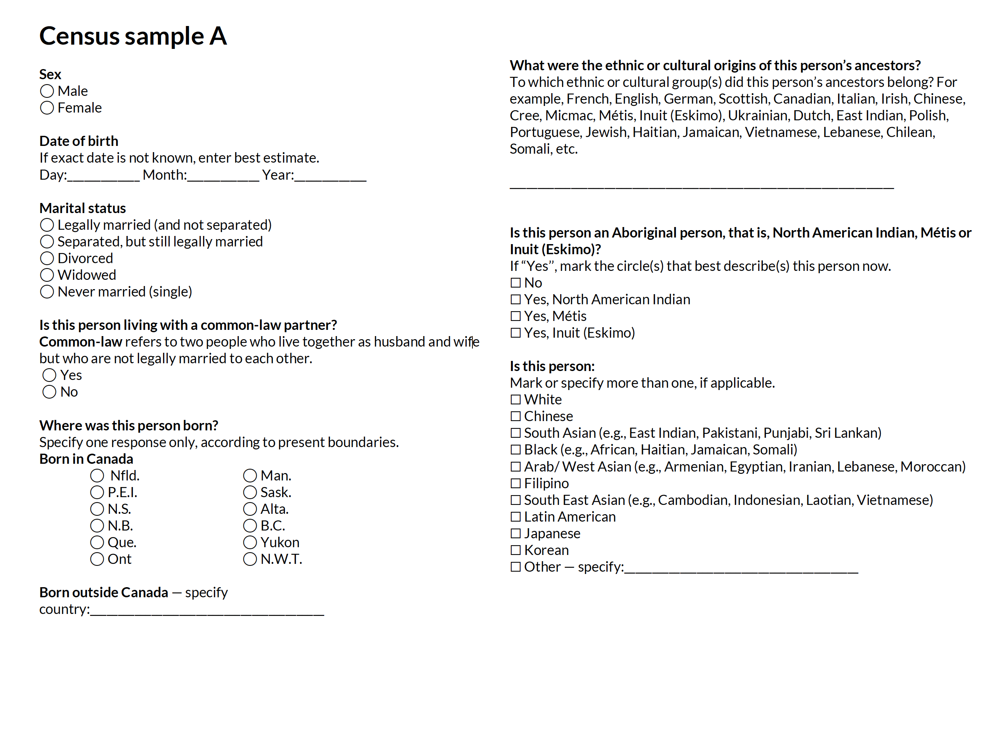
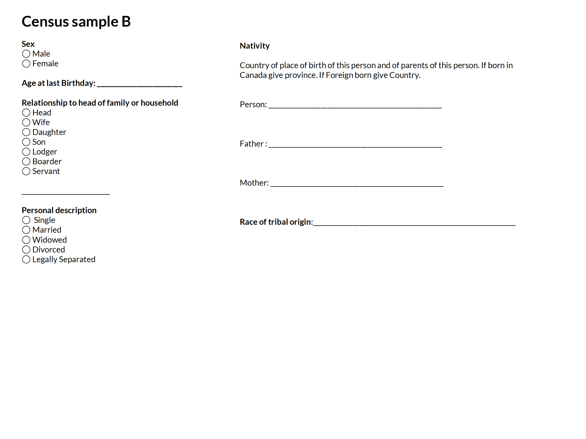
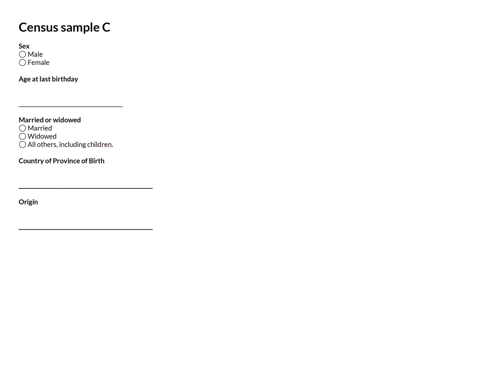
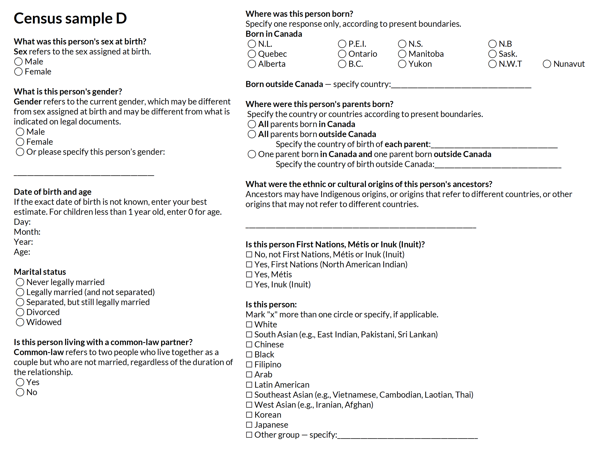
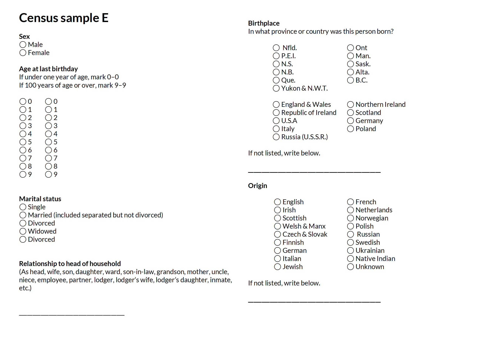
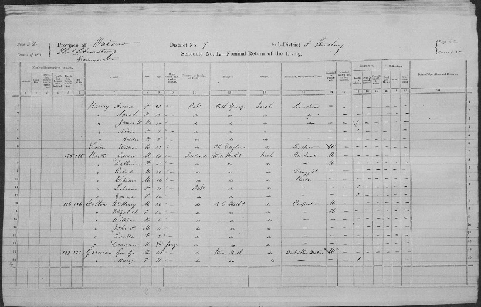
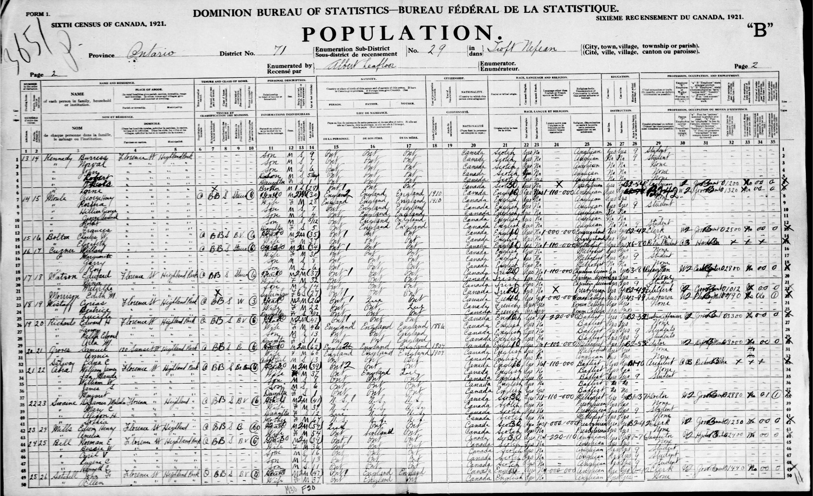
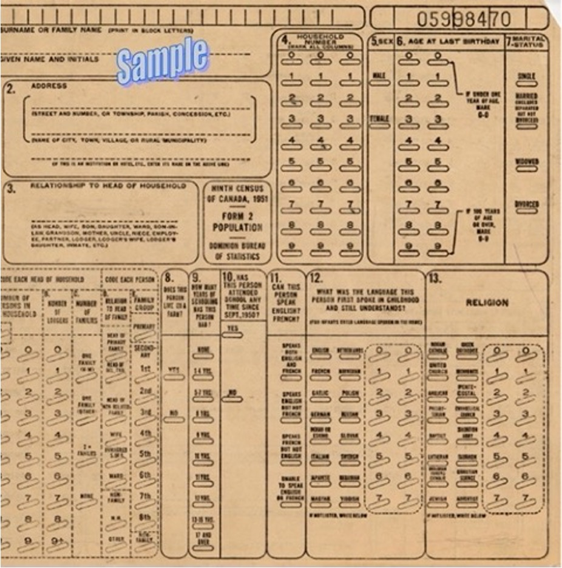
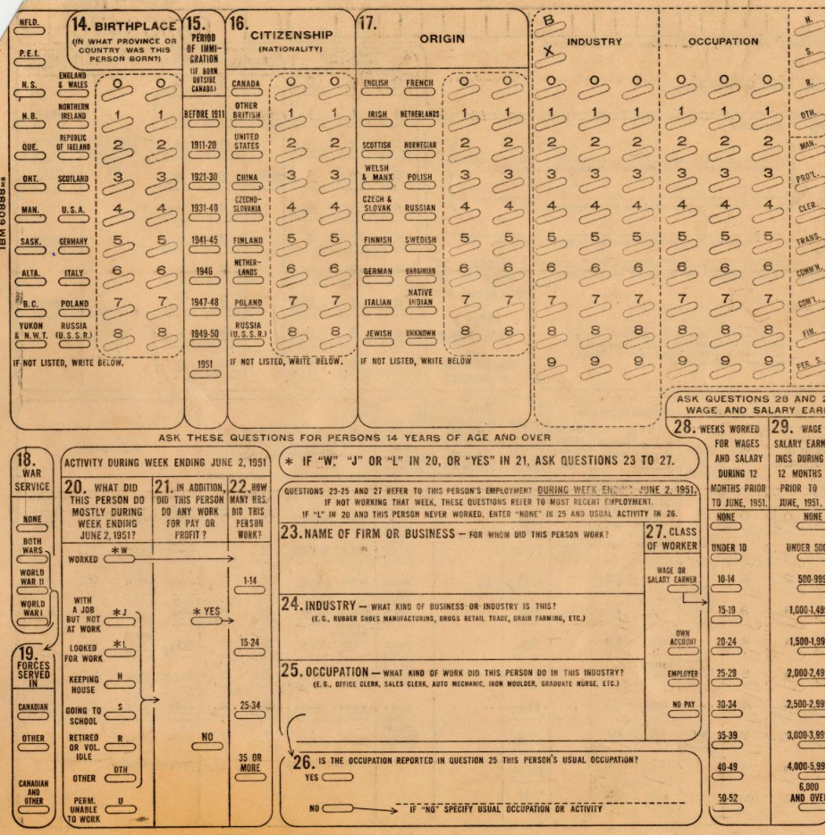

```{r setup, include=FALSE}
knitr::opts_chunk$set(echo = FALSE)
```

The following activity is from a sample seminar with my [STA497 students](https://www.lizabolton.com/reading_courses.html#ethical-professional-practice-for-statisticians-research-group-202122) on 2021-11-17. It was intended as a model seminar for their own upcoming seminars about topics from *Calling Bullshit: The Art of Skepticism in a Data-Driven World*, by Carl Bergstrom and Jevin West (see: https://www.callingbullshit.org/) and covered more than just this activity. You can access the slides below

## Useful links
- [PDF version of activity](pdfs/census-detective-activity.pdf)

- Check your ordering with this [MS Forms quiz](https://forms.office.com/Pages/ResponsePage.aspx?id=JsKqeAMvTUuQN7RtVsVSEOKHUU3SzAJJhmOKjJhDWEpUOUY0T0haQ0VPSEJPWUs2Sk1WNjAyWEpWOS4u)

- [Slides (warning, spoilers!)](https://lizabolton.github.io/statistics-ethics-identity/#1)


## Background
The Constitution Act of 1867 set out the requirement for a census of the population to be taken every 10 years. The first of these decennial censuses took place in 1871 in the four original provinces (Ontario, Quebec, Nova Scotia, New Brunswick). The most recent of these censuses was conducted in 2021.

## Task
Complete each of the following census questionnaires about yourself. (Note, these are not the complete census forms, these are questions about sex/gender age and race/ethnicity.
These questions have been retyped and somewhat reformatted, but the original text has been preserved.
Once you have completed the forms, try to put them in chronological order from oldest to most recent census.

[[PDF version of activity](pdfs/census-detective-activity.pdf)]{style="background-color: #FFD700"}











Check your ordering with this [MS Forms quiz](https://forms.office.com/Pages/ResponsePage.aspx?id=JsKqeAMvTUuQN7RtVsVSEOKHUU3SzAJJhmOKjJhDWEpUOUY0T0haQ0VPSEJPWUs2Sk1WNjAyWEpWOS4u).


# WARNING: You'll see answers if you keep scrolling

```{r}
xaringanExtra::embed_xaringan(
  url = "https://lizabolton.github.io/statistics-ethics-identity/#1",
  ratio = "16:9"
)
```


### Solutions

<div style="width: 90%; margin: 10px 5% 10px 5%; background-color: #3c133f;">

<div style="position: relative; top: -10px; bottom: -10px; left: -10px; padding: 15px; background: #ffffff; border: 2px solid #3C133F;">
A = 1996  
B = 1921  
C = 1871  
D = 2021  
E = 1951  
</div>

</div> 

Something that I particularly love is that if you ordered these samples from shortest to longest, you have the order from oldest to most recent. I think this is a good indication of how our understanding of identity has become more complex, but also probably that our ability to manage and aggreagate data has improved greatly. 

### Comments & points of interest ^[_Guide to the Census of Population, 2016, Chapter 2 – Census history_ https://www12.statcan.gc.ca/census-recensement/2016/ref/98-304/chap2-eng.cfm]

- 2021 was the first census to include questions about both gender and sex, specifically defining sex as sex assigned at birth. 
- Prior to 2001 data was not collected on couples other than heterosexual couples.  
- For the 1951 census a new punch card technology was used make data tabulation faster.
- Yukon wasn't a territory until 1999 and so is not listed in the 1996 census.


# Census forms

### 1871 census records



1871 questionnaire image the result of searching "Elizabeth Bolton" on https://www.bac-lac.gc.ca/eng/census/1871/Pages/1871.aspx  

### 1921 census records


1921 questionnaire image the result of searching "Elizabeth Bolton" on  https://www.bac-lac.gc.ca/eng/census/1921/Pages/search.aspx  

### 1951 census form




1951 punch card (2 images) from http://www.ccri.uottawa.ca/CCRI/Images/1951%20Schedule.pdf (sourced via https://mdl.library.utoronto.ca/collections/numeric-data/census-canada/1951)

### 1996 census form

[PDF of 1996 census long form questionnaire]
(https://www12.statcan.gc.ca/access_acces/archive.action-eng.cfm?/english/census01/info/96-2b-en.pdf)

### 2021 census questionnaire
You can access the question text [here](https://www.statcan.gc.ca/en/statistical-programs/instrument/3901_Q2_V6) and a sample PDF [here]().
