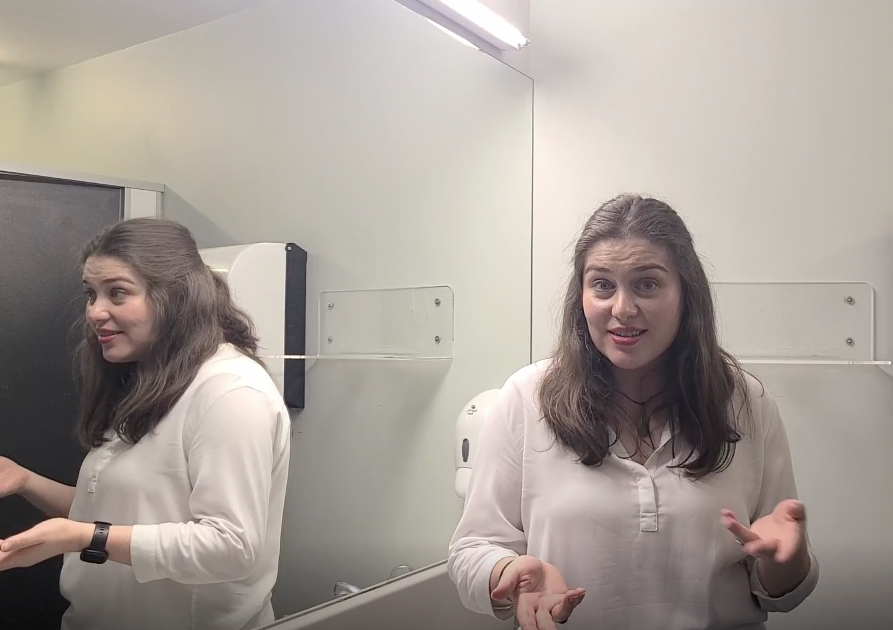
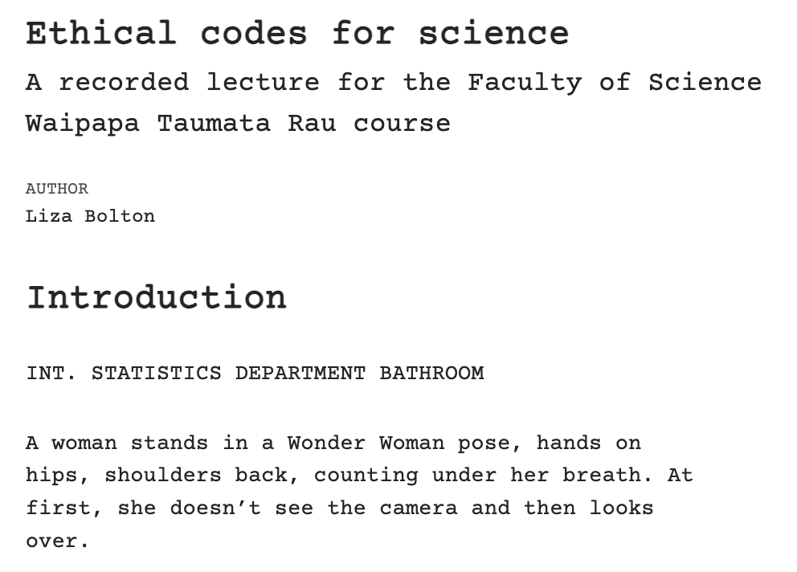

```{r setup, include=FALSE}
knitr::opts_chunk$set(echo = FALSE)
```

The University of Auckland Waipapa Taumta Rau has introduced new first year courses specific to each Faculty to help students transition to university study. More about the coursse [here](https://www.auckland.ac.nz/en/study/study-options/undergraduate-study-options/waipapa-taumata-rau-course.html).

I was invited to provide a recorded lecture on ethical codes and practice for science, and managed to sneak in a bit of a focus on statistics. Big thanks to Joei Mudaliar for letting me rope her into helping me film in the loo! (We put up a warning sign, don't worry!)

{fig-alt="Liza, a femme brunette in a white blouse, standing in a bathroom, gesturing to camera."}

I had some fun setting up the CSS to make it look like a traditional screenplay. You can read the full script [here](https://www.lizabolton.com/script.html).

{fig-alt="Screenshot of the beginning of the script HTML file, showing the fixed width font and formatting of a traditional screenplay."}

The CSS to make the [Quarto Document](https://quarto.org/) render like a screenplay was adapted from Scrippet by John August (johnaugust.com) and a [comment from Matthew Petty](https://groups.google.com/g/tiddlywiki/c/b_UMPaDaWP0/m/aZ2MzBtLpkoJ).
