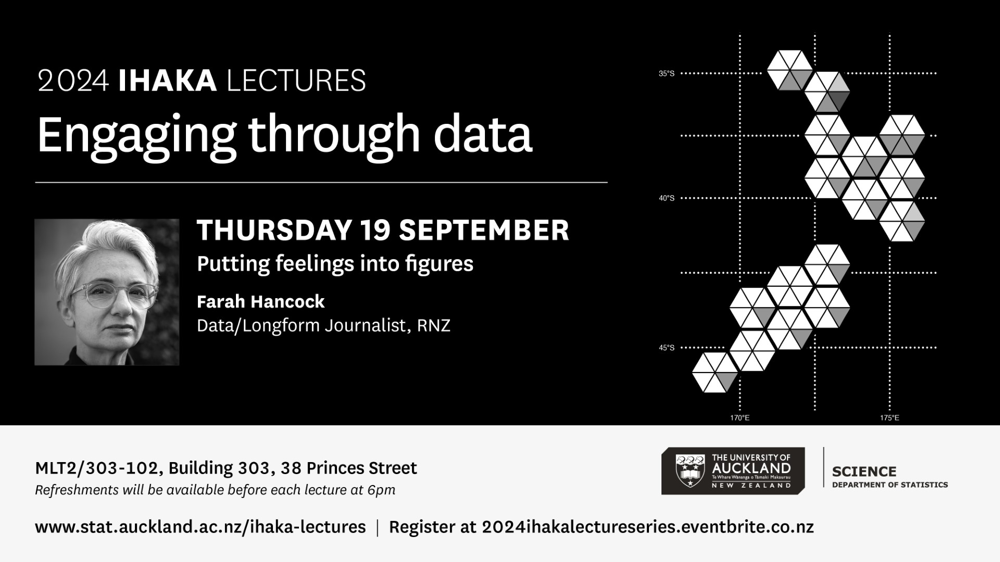

```{r setup, include=FALSE}
knitr::opts_chunk$set(echo = FALSE)
```

Kia ora! If you found your way here through my talk, thank you so much for coming. Skip down to the [annotated bibliography](https://blog.lizabolton.com/posts/2024-08-27-raising-the-bar-annotated-bibliography/#annotated-bibliography). If you found this some other way...welcome! There is some information on the event below.

## Event information
### Abstract
What do motivational posts on LinkedIn have in common with the supposedly small feet of Victorians? Join Dr Liza Bolton as she explores the habits of statistical thinking that can make our day-to-day lives better – from picking a restaurant like a statistician, to why you shouldn’t necessarily believe a bus stop advertisement when it tells you your hometown is one of New Zealand’s most monogamous. There are no mathematics prerequisites here – number lovers and loathers alike are invited on a romp through the good, the bad and the ugly from a world full of data and decisions.

### Bio
Dr Liza Bolton teaches statistics and data science at the University of Auckland, having recently returned from three years at the University of Toronto in Canada. She is also a statistical consultant, though tends to prefer the term “data ambassador” to describe her work representing people's data back to them in meaningful ways. Her interests lie in the realms of health, equity and education, with her research focusing on statistics education and applied statistics, specifically exploring social anVd economic predictors of mortality in Aotearoa.

### Event
6:30pm @[Norma Taps](https://normataps.co.nz/), 90 Wellesley Street West, Auckland CBD, Auckland 1010

Also speaking at this location at 8:00pm is [Rebecca Sharp](https://www.rtbevent.com/rebecca-sharp)

# Annotated bibliography

The formatting of this is probably a bit loose for a real 'annotated bibliography' — think of it as somewhere between one of those and a very lazy blog post.

```{r, echo = FALSE, eval = FALSE}
*I'm currently still adding to this section in the lead up to the talk.*

{fig-alt="AI generated image of a person in construction gear with colourful blocks and some sort of measuring device. Text in the image says: This post is a work in progress."} 
```


> "The best thing about being a statistician, is that you get to play in everyone’s backyard." ~ John Tukey

Brillinger, D. R. (2014). "... how wonderful the field of statistics is...". In Lin, X., Genest, C., Banks, D.L., Molenberghs, G., Scott, D.W., & Wang, J.-L. (Eds.). *Past, Present, and Future of Statistical Science* (1st ed.). Chapman and Hall/CRC. https://doi.org/10.1201/b16720 


## Te Awamutu: The ~~Rose~~ Monogamy Town of New Zealand? 🌹👩🏻‍🤝‍👨🏽

- [The original report from EliteSingles](https://www.elitesingles.co.nz/em/from-single-to-couple/monogamous-relationships)  
- New Zealand Herald coverage: Herald online. (2017, January 10). New Zealand's most monogamous town revealed. NZ Herald. Retrieved from: https://www.nzherald.co.nz/lifestyle/new-zealands-most-monogamous-town-revealed/ULLQJCPIQZB2HQXTN5XHW3XTKU/   

### Turns out you can't trust 'big garlic' 🧄...or 'big ergonomic chair'

I am a big fan of Hayden Donnell's work and the below Mediawatch episode from a year ago is no exception! It is a 9'31" listen and looks at the rise of coverage of 'research' provided by organisations that is intended as advertising much more than as an original contribution to human knowledge. 

- Donnell, H. (2023, June 25). One weird trick for getting uncritical media coverage [Radio broadcast]. Mediawatch. Retrieved from: https://www.rnz.co.nz/national/programmes/mediawatch/audio/2018895605/one-weird-trick-for-getting-uncritical-media-coverage

Importantly, the above story notes: "journalists who might have questions about a study's credibility [should] contact the publicly-funded [Science Media Centre](https://www.sciencemediacentre.co.nz/) for advice." For transparency, I'll note that I am listed on the [SciMex](https://www.scimex.org/about/scimex) directory and have been paid for a workshop for a Data Journalism program they were running.

## Don't tell me what the data says, the data says shit

The [We All Count](https://weallcount.com/) project for equity in data science has some incredible 'merch' to share some key ideas about their mission, to "work towards a world where data science is good, and good for everyone".

This is one of my favourites:


[Direct link to poster](https://society6.com/product/data-cant-actually-speak_print?sku=s6-22604816p4a1v3)

### Our world imperfectly becomes data

> "**Our world imperfectly becomes data.** If we are to use data nonetheless to learn about the world, then we need to actively seek to understand their imperfections and the implications of those imperfections." ~ Rohan Alexander

- Adore the above quote from my friend (and former colleague at the University of Toronto) Rohan Alexander in the [introduction to his (free!!) textbook, Telling Stories with Data ](https://rohanalexander.github.io/telling_stories-published/01-introduction.html). You can also purchase a print copy of this book from Chapman and Hall/CRC [here](https://www.routledge.com/Telling-Stories-with-Data-With-Applications-in-R/Alexander/p/book/9781032134772). Full citation:  Alexander, R. (2023). *Telling stories with data: With applications in R*. Routledge.      

> "There are three kinds of lies: Lies, damned lies, and statistics" ~ Mark Twain (attributing it to Benjamin Disreali, who may not have said it...and everyone attributes it to Twain now, except for me who gave the WRONG attribution in my bFM interview — the shame! 😳) 

Twain, M. *Chapters from My Autobiography*. http://www.gutenberg.org/files/19987/19987-h/19987-h.htm. Published 1906. Accessed August 27, 2024.

## The statistical-thinking bogs

The following is about students in intro stats classes, but I think it is also really helpful for checking in on your own thinking and anticipating how others may engage with your communication about data.

> ...students tend to enter and leave most introductory statistics courses thinking of statistics in one of at least two incorrect ways:
>
> 1\. Students believe that statistics and mathematics are similar in that statistical problems have a single correct answer; an answer that tells us indisputable facts about the world we live in (Bog #1: overconfidence) (Nicholson & Darnton, 2003; Pfannkuch & Brown, 1996),
>
> or,
>
> 2\. Students believe that statistics can be 'made to say anything,' like 'magic,' and so cannot be trusted. Thus, statistics is viewed as disconnected and useless for scientific research and society (Bog #2: disbelief) (Martin, 2003; Pfannkuch & Brown, 1996).
>
> Tintle, N., Chance, B., Cobb, G., Roy, S., Swanson, T., & VanderStoep, J. (2015). Combating Anti-Statistical Thinking Using Simulation-Based Methods Throughout the Undergraduate Curriculum. *The American Statistician*, *69*(4), 362--370. <http://www.jstor.org/stable/24592138>

📄 PDF: <https://arxiv.org/pdf/1508.00543.pdf>

{alt="Two AI images generated by DALLE 2 from the prompt \"dramatic oil painting of a swamp\""}

## Picking a restaurant like a statistician (and reading political polls)

- Evans, M. J., & Rosenthal, J. S. (2010). *Probability and statistics: The science of uncertainty* (2nd ed.). W.H. Freeman and Co. ([Now available for free in pdf format!](https://www.utstat.utoronto.ca/mikevans/jeffrosenthal/))
  - And for other textbooks that do a nice job explaining the discipline with their headlines: 
Statistics: The Art and Science of Learning from Data, 5th edition

- If in your own work/play, you have data and need to sort things based on rankings, this post by Evan Miller, *How not to sort by average rating*, has some fun stuff: https://www.evanmiller.org/how-not-to-sort-by-average-rating.html

  - At the time of writing, Norma Taps, the venue for this talk has a [4.9 rating out of 53 reviews on Google](https://www.google.com/search?q=norma+taps&rlz=1C5CHFA_enCA883CA883&oq=norma+taps&gs_lcrp=EgZjaHJvbWUqBggAEEUYOzIGCAAQRRg70gEIMTE2NGowajeoAgCwAgA&sourceid=chrome&ie=UTF-8#lrd=0x6d0d473c655fadf1:0xfa49aa208ce93ec6,1,,,,) (good work, guys! I'm sure they'd appreciate a few reviews for the data savvy folks who attended). This is like saying they have a 97.5/% score out of 100. With a bit of simulation (see Anna's tool below), this means at worst, they're probably at least a 4.6 average experience. But a restaurant with the same 4.9 reviews average from only 10 reviews is consistent with at worst being a 3.8 experience.
  - Note, this is how you make a 5-star scale into value out of 100% (should you is another question! some useful discussion [here](https://measuringu.com/convert-point-scales/)): $$\frac{\text{rating} - 1}{4} = \text{value on a 0 to 100 scale}$$
  
- The incredible researcher and educator, [Anna Fergusson](https://www.linkedin.com/in/anna-fergusson-nz/?originalSubdomain=nz) (who I feel VERY lucky to call a friend),  has a fun [blog post](https://teaching.statistics-is-awesome.org/a-simple-app-that-only-does-three-things/) and [tool](https://learning.statistics-is-awesome.org/threethings/) that "just does three things": it lets you play with how your observed result (purple line) compares to data generated from a comparison/null model of your choice (black line and the grey bar of uncertainty around it), based on different sample sizes.

- Reading political polls:
  - [This article](https://www.nzherald.co.nz/nz/election-2023-all-the-things-you-need-to-consider-before-reading-a-political-poll/R3UGYA5CORAK3GFIOCGR4Y3VD4/) features advice from the University of Auckland's own [Prof. Thomas Lumley]() and Victoria University’s Richard Arnold. Full reference: Gabel, J. (2023, August 13). *Your guide to reading the NZ political polls 2023*. NZ Herald. Retrived from: https://www.nzherald.co.nz/nz/election-2023-all-the-things-you-need-to-consider-before-reading-a-political-poll/R3UGYA5CORAK3GFIOCGR4Y3VD4/

## Motivational memes, the small feet of Victorians and armouring planes 


> "You miss 100% of the shots you don't take" ~ Wayne Gretzky

- There is some [uncertainty about the provenance of the above quote and there are previous sayings in sports that serve a similar purpose](https://english.stackexchange.com/questions/381542/what-was-the-first-use-of-the-saying-you-miss-100-of-the-shots-you-dont-take), but this version is widely attributed to Wayne, including by himself in this [MasterClass](https://www.masterclass.com/classes/wayne-gretzky-teaches-the-athlete-s-mindset/chapters/you-miss-100-of-the-shots-you-don-t-take).

- [The Bell Homestead in Brantford, Ontario, Canada](https://www.brantford.ca/en/things-to-do/history.aspx), where the first Alexander Graham Bell worked on his telephone design, eventually winning the first US Patent for it.
  - I couldn't find any write-up online about the tiny-waisted garment I remember, unfortunately.
  
- An example of the kind of "famous failures" motivational post I have seen a lot of:

{alt="A grid of 15 'famous failures' from www.TheQuotes.net"} [Image source](https://www.thequotes.net/2013/08/failures-are-stepping-stones-to-success/)

- [Survivorship bias](https://thedecisionlab.com/biases/survivorship-bias), a guide from the Decision Lab, including examples for Finanical Systems and Medical Research
  - More on Abraham Wald's work with the Statistical Research Group at Columbia during World War II from [History of Data Science](https://www.historyofdatascience.com/abraham-wald-a-statistical-hero/).

- Gene Roddenberry survived TWO plance crashes before creating Star Trek. Source: Alexander, David (1995). Star Trek Creator: The Authorized Biography of Gene Roddenberry. New York: Roc. ISBN 0-451-45440-5.
  - 📙 [Auckland Libraries appears to have a copy](https://discover.aucklandlibraries.govt.nz/search/card?id=1a715bf6-3bb3-5734-b90d-bb2095e94a70&entityType=FormatGroup)

- What did the neolithic art we don't know about look like? Fun TikTok from [@dougweaverart](https://dougweaverart.org/) about survivourship bias in our understanding of pre-historic peoples, and how the future might misunderstand us.
<blockquote class="tiktok-embed" cite="https://www.tiktok.com/@dougweaverart/video/7398908419471854894" data-video-id="7398908419471854894" style="max-width: 605px;min-width: 325px;" > <section> <a target="_blank" title="@dougweaverart" href="https://www.tiktok.com/@dougweaverart?refer=embed">@dougweaverart</a> @Charlotte There is a tendency to vote prehistoric people as primitive, superstitious, and serious. I just like to acknowledge that they may have been innovative, practical, and a little bit silly. <a title="greenscreen" target="_blank" href="https://www.tiktok.com/tag/greenscreen?refer=embed">#greenscreen</a> <a title="prehistory" target="_blank" href="https://www.tiktok.com/tag/prehistory?refer=embed">#prehistory</a> <a title="arthistory" target="_blank" href="https://www.tiktok.com/tag/arthistory?refer=embed">#arthistory</a> <a title="history" target="_blank" href="https://www.tiktok.com/tag/history?refer=embed">#history</a> <a target="_blank" title="♬ original sound - dougweaverart" href="https://www.tiktok.com/music/original-sound-7398908415701027627?refer=embed">♬ original sound - dougweaverart</a> </section> </blockquote> <script async src="https://www.tiktok.com/embed.js"></script>


# If you liked this talk...

...or if you didn't, but like statistics and statistical thinking!

- Join us for the [Ihaka Lecture Series](https://www.auckland.ac.nz/en/science/about-the-faculty/department-of-statistics/ihaka-lecture-series.html) is an annual lecture series named after Associate Professor Ross Ihaka in honour of his contributions to the field. *Ross Ihaka, along with Robert Gentleman, co-created R – a statistical programming language now used by the majority of the world’s practising statisticians.*
  - **Engaging through data**: *The 2024 Ihaka Lecture Series features three speakers that bring together visualisation, teamwork and reproducibility. They share their real-world experience in developing engaging visualisations, bringing people and tools together and a vision for reproducible data analysis.*
  
{alt="Poster for Farah Hancock's 2024 Ihaka Lecture on Thursday 19 September. Farah is a Data/Longform journalist with RNZ and her talk is titled 'Putting feelings into figures'."}  
  
- [*Calling Bullshit: The Art of Skepticism in a Data-Driven World*](https://callingbullshit.org/) is both a book and a series of recorded lecturers and case studies.  

> "Science is not a magic wand that turns everything it touches to truth. Instead, "science operates as a procedure of uncertainty reduction," said Nosek, of the Center for Open Science. “The goal is to get less wrong over time.” This concept is fundamental — whatever we know now is only our best approximation of the truth. We can never presume to have everything right." ~ Christie Aschwanden

- The above quote is from Aschwanden, C. (2015). *Science Isn’t Broken*. FiveThirtyEight. Retrieved from https://fivethirtyeight.com/features/science-isnt-broken/

- [Talk notes from a panel Dr Karatiana Taiuru, Keith Ng and I was part of for the Science Communicators Association of New Zealand](https://blog.lizabolton.com/posts/2023-11-15-scanz/)


- Study opportunities in Statistics and Data Science
We have a range of undergraduate and postgraduate study options, with several catering to professionals wanting to upskill. Come learn with us! 
  - [Explore your study options in Data Science.](https://www.auckland.ac.nz/en/study/study-options/find-a-study-option/data-science.html#utm_source=data-sci&utm_medium=subject-guide&utm_campaign=2018-sci-ug-subject-guides) 
  - [Explore your study options in Statistics.](https://www.auckland.ac.nz/en/science/about-the-faculty/department-of-statistics/study-statistics.html)
  
<iframe width="560" height="315" src="https://www.youtube.com/embed/XMAuPESg-1w?si=NY7ADJu_WlfZIyOy" title="YouTube video player" frameborder="0" allow="accelerometer; autoplay; clipboard-write; encrypted-media; gyroscope; picture-in-picture; web-share" referrerpolicy="strict-origin-when-cross-origin" allowfullscreen></iframe>
